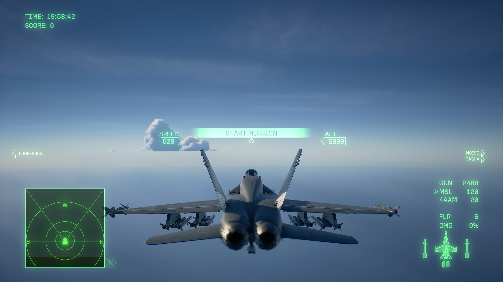

# ace8-cloudfix-linux

Workaround for a shader compilation bug in **Ace Combat 8: Wings of the Theve**
(Steam AppID 2288340) that causes volumetric clouds to disappear below the
horizon when running on NVIDIA GPUs under Proton on Linux.




## Usage

### 1. Dump the shaders

**Lutris:** configure the game, go to **System options → Environment variables**,
and add:

```
VKD3D_SHADER_DUMP_PATH=/absolute/path/to/dump
```

**Steam:** right-click the game → **Properties** → **General** → **Launch
Options**, and set:

```
VKD3D_SHADER_DUMP_PATH=/absolute/path/to/dump %command%
```

Launch the game once and let the shader warmer finish, then exit. The dump
directory should contain several thousand '.spv' files (roughly 6 GB for a
full warmup).

### 2. Patch the shaders

Run the tool from your game's prefix directory:

```bash
cd /path/to/your/ace8/prefix
/path/to/ace8-cloudfix.sh all
```

The tool defaults to '<current directory>/shadercache/' for the dump location,
so if you run it from the game prefix after dumping there, you can just hit
Enter. If not, it prompts you for the dump directory, builds a manifest, patches
the affected shaders, and validates the output.

On success, you get an 'ace8-overrides/' directory alongside your wineprefix
'drive_c/' (or wherever you launched the script, so pay attention so you don't
delete the override directory later on!).

### 3. Deploy

**Lutris:** add to the game's environment variables:

```
VKD3D_SHADER_OVERRIDE=/absolute/path/to/ace8-overrides
```

Remove 'VKD3D_SHADER_DUMP_PATH' from the same list.

**Steam:** replace the launch options with:

```
VKD3D_SHADER_OVERRIDE=/absolute/path/to/ace8-overrides %command%
```

Remove 'VKD3D_SHADER_DUMP_PATH' at this point. Otherwise the game re-dumps
~6 GB on every launch.

> If environment variables don't take effect on an older Steam client, prefix
> the line with 'env --'. This was a workaround for a Steam client regression
> that has since been fixed:
>
> ```
> env -- VKD3D_SHADER_OVERRIDE=/absolute/path/to/ace8-overrides %command%
> ```

### 4. Verify

Launch the game and load into a mission. Clouds should render below the
horizon, with proper terrain occlusion. Flying into a cloud should still
trigger the in-cloud effects.

If clouds are still missing, or if you see other rendering artifacts, open an
issue and attach 'ace8-work/patch.log'.

## Commands

```
ace8-cloudfix.sh discover [dump_dir]   Scan the shader dump and build a manifest
ace8-cloudfix.sh patch                 Apply the fix to each shader in the manifest
ace8-cloudfix.sh verify                Validate the patched shaders
ace8-cloudfix.sh all [dump_dir]        Run discover, patch, and verify in sequence
ace8-cloudfix.sh help                  Show usage
```

## The Bug

The game's 'SkyTraceCS' compute shaders initialize invalid cloud and cirrus
ranges to '(-1, -1)', then pack those values into half precision after dividing
by 131072. The generated SPIR-V applies 'OpQuantizeToF16' to '-1/131072', a
half-precision subnormal that underflows to negative zero. The invalid sentinel
then passes the inclusive range check, produces a zero-length raymarch step,
and the cloud never renders.

The result: clouds are present in the game's logic. You can fly into them and
trigger the in-cloud effects, but the volumetric geometry below the aircraft
is clipped by a sharp horizontal plane.

## The Fix

The affected 'OpQuantizeToF16' is rewritten to an 'OpCopyObject' so the
original value reaches the packing instruction unchanged. The patched shaders
are supplied to the game via 'VKD3D_SHADER_OVERRIDE', which vkd3d-proton
consults before compiling its own copy. No game files, Proton builds, or
system packages are modified.

For a full description of the mechanism and the original manual fix, see
[ValveSoftware/Proton#10198](https://github.com/ValveSoftware/Proton/issues/10198).

## Requirements

- Linux with Arch, CachyOS, SteamOS, or any distro with 'spirv-tools' in its
  repos.
- 'spirv-tools':

  ```
  sudo pacman -S spirv-tools
  ```

- The game running under Proton. NVIDIA GPUs are affected; AMD and Intel are
  not. (Shaders are dumped with 'VKD3D_SHADER_DUMP_PATH' in step 1 above.)

## How it works

1. **Discover.** Scans the dump for '.spv' files containing an
   'OpQuantizeToF16' whose operand is the '-1/131072' sentinel. Records each
   match in a manifest as '(hash, result_id)'.

2. **Patch.** For each manifest entry, disassembles the shader to SPIR-V
   assembly, rewrites the target 'OpQuantizeToF16' to 'OpCopyObject', then
   reassembles the shader with '--target-env vulkan1.1' (SPIR-V 1.3, matching
   the original) and '--preserve-numeric-ids'. Output files keep their original
   names so 'VKD3D_SHADER_OVERRIDE' finds them.

3. **Verify.** Runs 'spirv-val --target-env vulkan1.3' on every patched file.
   If any file fails validation, the override directory is not safe to use
   and the tool exits with an error.

## Compatibility

Tested on an RTX 3090 with GE-Proton11-7. The bug is a shader-level issue, so
the Proton version should not matter, only that the game uses the same shader
hashes.

If the game is updated and the shader hashes change, the 'discover' command will find a
different set. The tool warns when the discovered count differs from the
known-good reference of 16 and when the hashes don't match. If you see either
warning, the patch may still work but should be verified in-game.

## Credits

The original analysis and manual fix were described by
[`empty-quiver`](https://github.com/ValveSoftware/Proton/issues/10198) in the
Proton issue tracker. Thank you very much! 
He made his own script, go check it! https://github.com/empty-quiver/ac8-cloud-patcher

## License

MIT. See [LICENSE](LICENSE).
